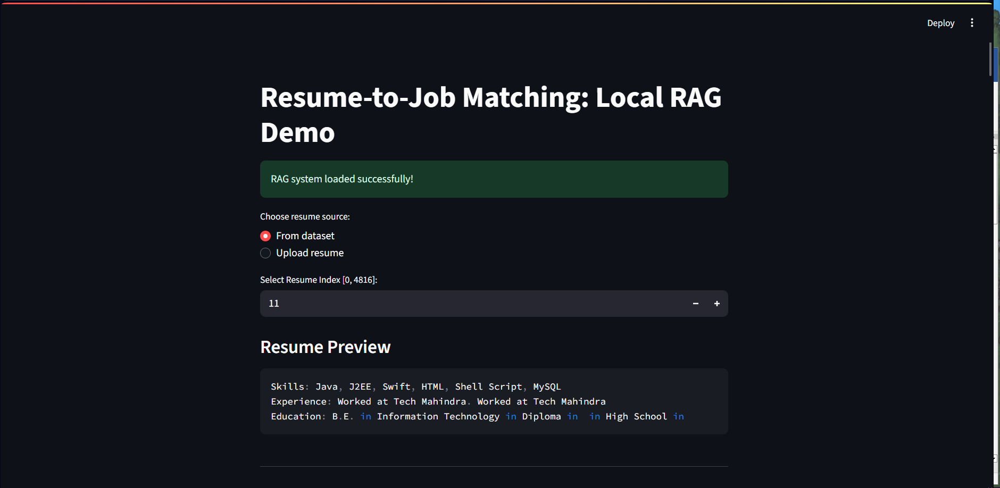
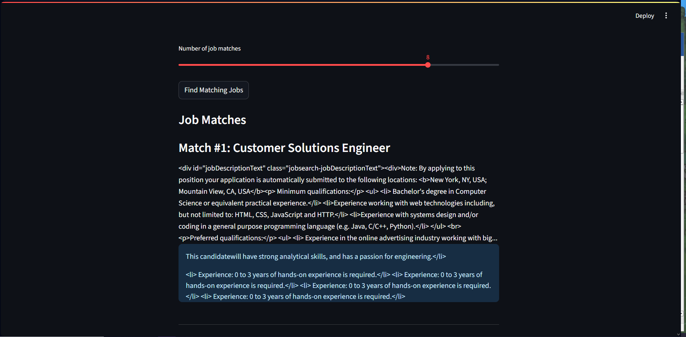
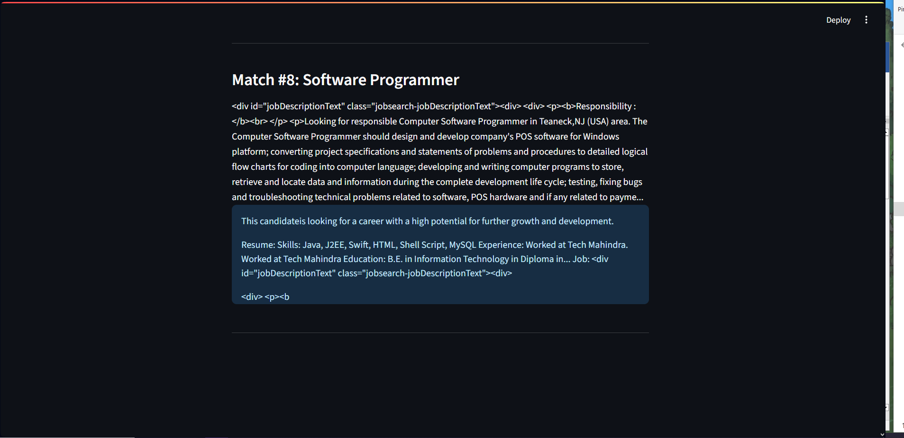

## README: Resume-to-Job Matching RAG System

### 🔍 Overview

Want to quickly match candidate resumes to the most relevant jobs—**locally, without sharing your data or an API key**? This repository provides a pragmatic, no-fluff solution that combines **Retrieval-Augmented Generation (RAG)** and a **local LLM** to generate high-quality, explainable job matches for resumes.

With **Streamlit** as the front-end, a compact and fast **SentenceTransformer** for embeddings, and the efficient **facebook/opt-1.3b** LLM (no needed authentication, just works on machines with 16 GB RAM), you can test out RAG-powered job-resume matching directly on your own laptop.

---

### 🚀 Features & Flow

- **Local End-to-End Pipeline:** No data leaves your machine—everything runs locally using open-source models.
- **Simple UI:** Select a resume from the demo dataset or upload your own (plain text).
- **Semantic Search:** Job descriptions and resume text are vectorized with **all-MiniLM-L6-v2** and indexed using **FAISS** for fast nearest-neighbor search.
- **LLM-Powered Explanations:** For each match, a local Mistral-7B LLM generates a useful, human-style summary explaining skill matches, gaps, and fit.
- **Resource-Friendly:** Designed to run on a single GPU box (**16 GB RAM** tested), making it accessible for almost anyone.
- **No Authentication Required:** Models and data are loaded locally. No keys, no tracking.

---

### 🦾 Strengths

- **Privacy by Design:** All processing is *fully local* — ideal for sensitive hiring workflows or experimentation.
- **Transparent Matching Logic:** Combines semantic retrieval with free-text explanation, so you can *see why* a match was chosen.
- **Easy to Extend:** Modular Python, clean Streamlit front-end, clear data structures.
- **Quick Setup:** Minimal dependencies, no cloud configuration, no fiddling with access tokens.

---

### 😅 Weaknesses

- **Limited Model Size:** facebook/opt-1.3b is great for local use, but may miss deeper context compared to cloud LLMs.
- **Fixed Dataset:** Jobs and resumes are static CSV/JSONL files; real-time job feeds or online resume parsing are not integrated (see "Future Work").
- **No Info Extraction from PDFs:** Uploaded resumes must be plain text. No PDF/Word/HTML parsing yet.
- **Speed:** On CPU, embedding or LLM inference can be slow. GPU strongly recommended.
- **Not HR-Grade:** This is a demo tool waiting to become production-ready for serious candidate screening.

---

### 🛠 How it Works

**1. Data Loading:**  
Jobs and resumes (sampled from a Kaggle marketing jobs dataset and a HuggingFace resume dataset) are loaded and preprocessed. Resume info (skills, experience, education) is parsed into readable text.
- Kaggle data link: https://www.kaggle.com/datasets/promptcloud/indeed-job-posting-dataset/code
- HF data link: https://huggingface.co/datasets/datasetmaster/resumes/tree/main

**2. Embedding & Indexing:**  
- Each job description and resume is embedded as a vector (using `sentence-transformers/all-MiniLM-L6-v2`).
- Job embeddings are indexed using **FAISS** for efficient semantic search.

**3. Retrieval:**  
For any given resume, the system retrieves the top K most similar jobs based on embedding cosine similarity.

**4. Generative Explanation:**  
Each match is explained by prompting the local facebook/opt-1.3b LLM:  
> "Summarize skill matches, missing elements, and whether this candidate is a good fit."

**5. UI/Interaction:**  
Easy resume browsing, upload, and results viewing using Streamlit—including code previews of resumes, job descriptions, and AI explanations.

---

### 🧠 Why This LLM?

The demo uses `mistralai/Mistral-7B-Instruct-v0.2`, which is compact enough to run locally on a **standard 16 GB machine**, while still providing thoughtful, context-aware explanations. No authentication required, fully open-source, and no hidden calls to closed APIs.

---

### 🤝 Combining RAG + LLM

- **Retrieval-Augmented Generation** blends two strengths:
  - **Retrieval (R):** Uses semantic search to quickly surface the most relevant job descriptions for a provided resume.
  - **Generation (G):** Leverages LLMs to generate human-like, helpful explanations, mapping candidate skills/experience to job requirements.

The result: More accurate recommendations, explainable matches, and actionable insights for both candidates and recruiters—*without requiring massive cloud resources*.

---

### 🏗️ Future Work

- **Dynamic Data:** Integrate live job feeds and web scraping for up-to-date postings and candidates.
- **Richer Formats:** Add parsing for uploaded PDFs/Word resumes and LinkedIn/Indeed profiles.
- **More Powerful Models:** Optional support for larger local LLMs or remote (API) LLMs for premium explanations or QA.
- **Active Learning:** Let users rate explanations to improve relevance and surface more nuanced matches.
- **Better Explainability:** Visualize embedding similarity, highlight skill/experience overlap, and more.
- **Production Hardening:** Add authentication, rate limiting, and robust error handling for real business use-cases.

---

## 📦 Quickstart

**Requirements:** Python 3.11+, 16 GB RAM (that is for my machine), (GPU highly recommended)

\```
git clone https://github.com/yourname/resume-job-matching-rag.git
cd resume-job-matching-rag

pip install -r requirements.txt

# Download models as needed (see script/LLM instructions)

streamlit run streamlit_02.py
\```

**Note:** Data files must be placed in `./Data/`. See variable settings in `rag_01.py`.

---

## 📝 File Structure

| File                   | Description                                   |
|------------------------|-----------------------------------------------|
| `rag_jobs_01.py`            | Core RAG Python class, handles jobs/resumes, embedding, retrieval, and LLM generation |
| `streamlit_02.py`      | Streamlit UI front-end, integration glue      |
| `requirements.txt`     | Python requirements (not included—define based on import list in files) |

---

## 🖼️ Screenshots from streamlit





